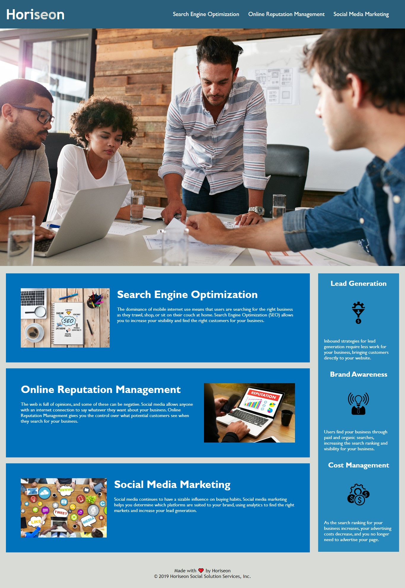

# horiseon-challenge
This application is for Horiseon Limited - a digital advertising
agency based in the UK. The application showcases their service offerings 
and the essential benefits they can bring to clients desiring  
to improve their online presence and brand influence across social media.

[Link](https://contentcommando.github.io/horiseon-challenge/)  to the modified application.

## Improvements
I have made improvements to this application in order to enhance its **accessibility
for search engines**. This also means that users with visual disability will 
have a better experience accessing and interacting with the application. I 
achieved this by refactoring the codebase of the application in the following ways:

* Added semantic HTML elements throughout the source code (with explanatory comments).
* Structured the HTML elements in a logical order.
* Added `alt` attributes to all Image and icon elements (with descriptions). 
* Checked and modified heading attributes  to follow a sequential order.
* Added SEO-friendly phrase to the title element.
* Checked and modified all links to make them functional.

## Lessons
This project has been a great opportunuty for extensive practice in structuring
a codebase logically with semantics HTML and linking it appropriately to a CSS file
for a functional application. I have also been able to improve my ability to debug a source code.

## Mock-up
Below is a mock-up of the page after my code-refactoring.

